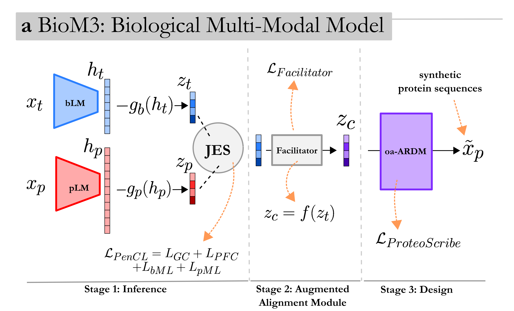

# BioM3: Biological Multi-Modal Model for Text-to-Protein Sequence Generation




***Update March 2025:*** Code for preprint on experimental validation text-to-protein design is planned to be released shortly. The current preprint version can be found [here](https://www.biorxiv.org/content/10.1101/2024.11.11.622734v1). To implement and benchmark BioM3, we recommmend using the more succinct version: [HuggingFace reporsitory](https://huggingface.co/niksapraljak1/BioM3). A live version for quickly testing BioM3 is on HuggingFace spaces called [BioM3-app](https://huggingface.co/spaces/niksapraljak1/BioM3-app). 

# Introduction

Welcome to the repository for the Biological Multi-Modal Model (BioM3). As described in our preprint, BioM3 is a framework enabling the design of functional proteins directly from natural language descriptions. It bridges text and protein biology through three key stages: aligning protein-text and protein-protein representations with large language models and contrastive learning (PenCL), enhancing text embeddings with a neural network (Facilitator), and generating protein sequences conditioned on text using an order-agnostic diffusion model (Proteoscribe). This approach achieves state-of-the-art results in zero-shot tasks and, significantly, has produced the first experimentally validated functional proteins designed purely from text prompts, showcasing its potential for intuitive protein engineering. Here you'll find the code and model weights to explore and utilize BioM3.

## Citation

If you use this code, please cite:

```bibtex
Natural Language Prompts Guide the Design of Novel Functional Protein Sequences
bioRxiv 2024.11.11.622734
doi: https://doi.org/10.1101/2024.11.11.622734
```

[Read the paper on bioRxiv](https://www.biorxiv.org/content/10.1101/2024.11.11.622734v1)
